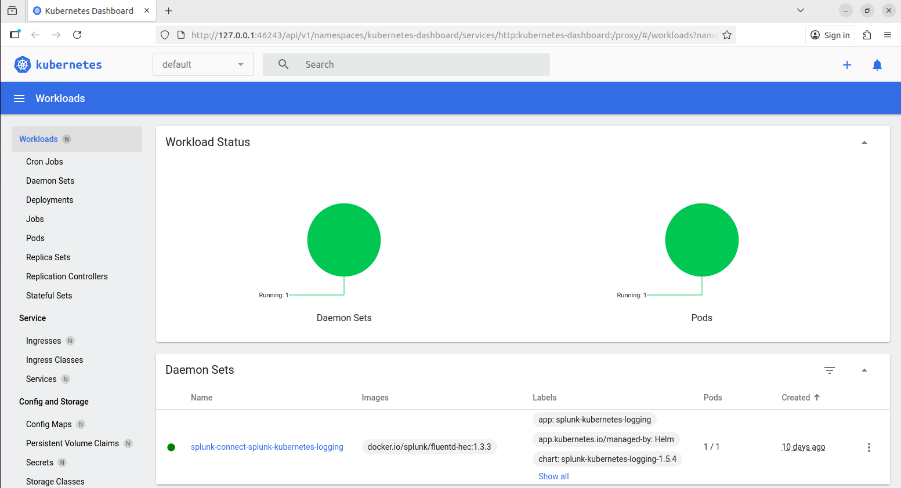
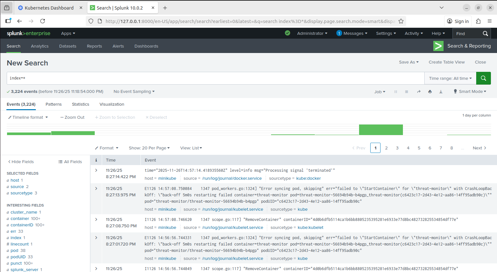
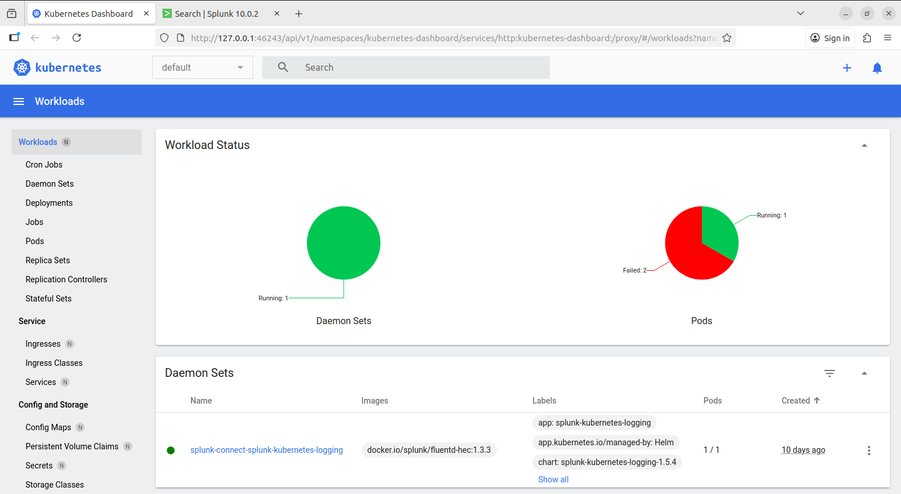
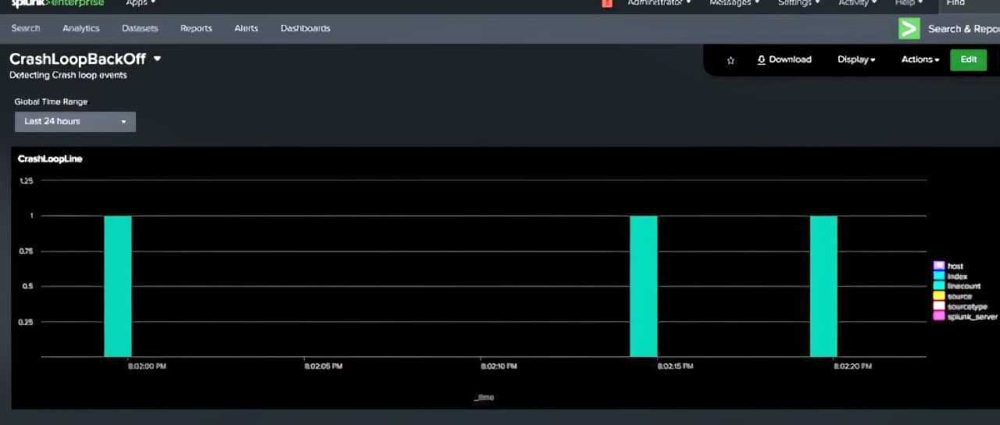
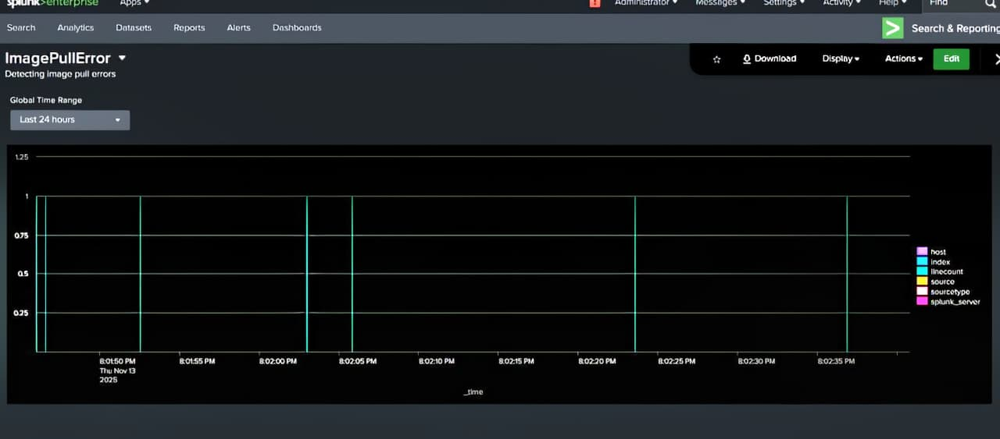

# 📡 Kubernetes Real-Time Monitoring Using Splunk

Real-time observability, log analytics, and failure detection for Kubernetes clusters using **Splunk Enterprise + Splunk Connect for Kubernetes (SCK)**.
This setup is fully tested and verified on **Minikube**.

---

## 📘 Table of Contents

* [Overview](#overview)
* [Features](#features)
* [Architecture](#architecture)
* [Repository Structure](#repository-structure)
* [Prerequisites](#prerequisites)
* [Installation Steps](#installation-steps)
* [Minikube Setup](#minikube-setup)
* [Simulating Kubernetes Failures](#simulating-kubernetes-failures)
* [Screenshots (Before & After Simulation)](#screenshots-before--after-simulation)
* [Splunk Dashboards](#splunk-dashboards)
* [Validating Real-Time Monitoring](#validating-real-time-monitoring)
* [Future Enhancements](#future-enhancements)
* [License](#license)

---

## 🧩 Overview

This project demonstrates **real-time Kubernetes monitoring** using Splunk’s observability stack.
It collects and visualizes:

* Pod logs
* Node logs
* Kubernetes events
* CrashLoopBackOff events
* ImagePullBackOff failures
* Deployment failures
* Cluster health

The project uses:

* **Splunk Enterprise (Docker Compose)**
* **Splunk Connect for Kubernetes (DaemonSet + Metrics Pipeline)**
* **Minikube cluster**
* **Custom failure simulation YAML**

---

## 🚀 Features

✔ Real-time monitoring with Splunk  
✔ Minikube-compatible (tested thoroughly)  
✔ Pod + node log ingestion  
✔ Kubernetes object event ingestion  
✔ DaemonSet-based Fluentd log collectors  
✔ Failure simulation: CrashLoopBackOff, ImagePullError  
✔ Custom Splunk dashboards for error visualization  
✔ Before/After comparison screenshots included


---

## 🏗 Architecture

```
      +------------------+
      |   Minikube       |
      | Kubernetes Nodes |
      +--------+---------+
               |
               | Logs / Events / Metrics
               v
+----------------------------------------+
| Splunk Connect for Kubernetes (SCK)    |
| - Fluentd logging DaemonSet            |
| - Metrics collector                    |
| - Objects collector                    |
+-------------------+--------------------+
                    |
                    | HEC (port 8088)
                    v
          +----------------------+
          |   Splunk Enterprise  |
          | Dashboards & Alerts  |
          +----------------------+
```

---

## 📁 Repository Structure

```
├── docker-compose.yaml              # Deploys Splunk Enterprise locally
├── splunk-connect-values.yaml       # Helm values for SCK
├── simulate-k8s-failures.yaml       # Failure simulation manifest
├── README.md                        # Documentation
```

---

## ✔ Prerequisites

* Minikube (preferred for easy testing)
* Docker & Docker Compose
* kubectl
* Helm v3+
* 8GB RAM minimum

---

## 🧱 Minikube Setup

Start Minikube:

```bash
minikube start --driver=docker
```

Verify:

```bash
kubectl get nodes
```

Enable Kubernetes dashboard (optional):

```bash
minikube dashboard &
```

---

## 🛠 Installation Steps

### **1️⃣ Deploy Splunk Enterprise**

```bash
docker-compose up -d
```

Splunk UI:
👉 [http://127.0.0.1:8000](http://127.0.0.1:8000)
Credentials:

```
admin / Admin@123
```

Enable HEC:
Settings → Data Inputs → HTTP Event Collector → Enable

Create a new HEC token:

```
Name: k8s-monitoring
Index: main
```

---

### **2️⃣ Install Splunk Connect for Kubernetes (SCK)**

Add the Helm repo:

```bash
helm repo add splunk https://splunk.github.io/splunk-connect-for-kubernetes
helm repo update
```

Install:

```bash
helm install sck splunk/splunk-connect-for-kubernetes \
    -f splunk-connect-values.yaml
```

This deploys a **DaemonSet** visible in Minikube dashboard.

---

## 🧪 Simulating Kubernetes Failures

The simulation manifest includes:

* CrashLoopBackOff pod
* ImagePullBackOff pod
* Heavy CPU pod
* Liveness/readiness failure

Run:

```bash
kubectl apply -f simulate-k8s-failures.yaml
```

Check status:

```bash
kubectl get pods
```

---

# 📸 Screenshots (Before & After Simulation)

## **1️⃣ Minikube Dashboard – Before Simulation**



---

## **2️⃣ Splunk Dashboard – Before Simulation**



---

## **3️⃣ Minikube Dashboard – After Failure Simulation**

Shows **failed pods** (CrashLoopBackOff + ImagePullError).



---

## **4️⃣ Splunk Dashboards – CrashLoopBackOff Detection**



---

## **5️⃣ Splunk Dashboards – ImagePull Error Detection**



---

# 📊 Splunk Dashboards

Dashboards created:

### **CrashLoopBackOff**

```
index=* "CrashLoopBackOff"
```

### **ImagePullBackOff**

```
index=* "Failed" "ImagePull" OR "Back-off pulling image"
```

### **Pod Status Timeline**

```
index=* sourcetype=kube:events type=Warning
```

---

# 🔍 Validating Real-Time Monitoring

### **Search 1: Logs from DaemonSet**

```
index=main sourcetype="kube:container:stdout"
```

### **Search 2: Node System Logs**

```
index=main sourcetype=kube:docker OR sourcetype=kube:kubelet
```

### **Search 3: Events from Cluster**

```
index=main sourcetype="kube:objects:event"
```

---


---

## License 📜

This project is licensed under the MIT License - see the [LICENSE](LICENSE) file for details. ⚖️

---


